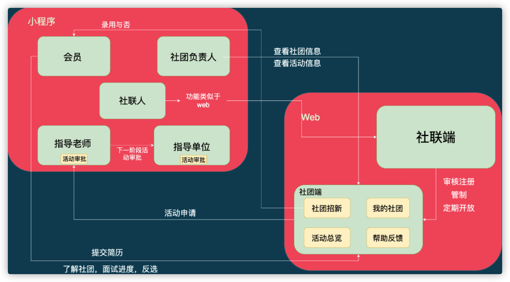

# 业务架构图

整个项目主要包括小程序端、web端

> 角色

* 学生
* 指导老师
* 指导单位
* 社团管理者
* 社员负责人
* 后台管理者

> 主要业务模块

* 活动审批
  * 申请提交
  * 老师、指导单位审核
  * 邮箱通知
* 社团招新
  * 招新开启
  * 展示信息
  * 学生报名
  * 面试流程
  * 反选
* 社团信息管理
  * 社团搜索
  * 社员查看
  * 社团管控

