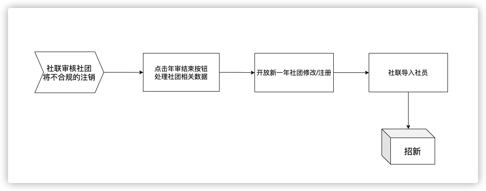

# 年审业务

## 年审结束按钮

运维端设置一个年审结束按钮，用于在社联对今年的社团进行审核后按下的确认按钮，主要会对数据做以下的操作：

#### 覆盖旧数据

将当前社团信息作为旧年信息覆盖一下旧年的记录（对在旧年存在的社团）

#### 插入新数据

插入新年存在的记录（仅对没有没被注销的社团，基本信息用默认的空白就行）

**账号审核**通过也会插入一条今年的记录在历史表club_year（解决第一年问题）

## 年审流程

注销 -> 年审结束 -> 开放社团修改/审核新注册的 -> 社联导入社员 -> 招新 

要限制判断是否进行了第二步才进行第三步

**年审按钮按下判断标准：regular表记录年审到的年份**

社联进行年审过程一定会是在新学年头的

## 修改开放注册/修改时间的要求

1. 开始与结束时间都是本学年
2. 本学年年审结束
3. 开始时间先于结束时间

#### 可以注册与审核社团的条件

在开放时间内即可

## 正式录入会员

**运维端**加个按钮，在反选时间过后，将反选结果录入正式会员

