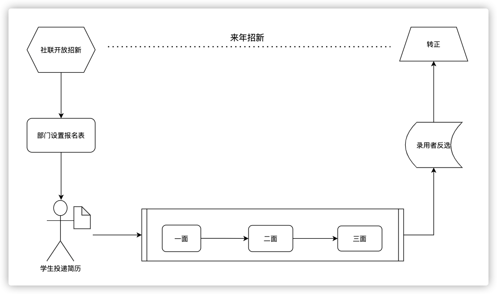

# 招新业务

### 允许招新条件

社团中某个部门可以被投递简历的需要满足的条件如下：

1. 部门所属社团账号通过审核，且在招新期间没有被注销

2. 社联端打开了“开放社团招新”按钮，进入招新阶段

3. 部门所属社团没有被社联强制暂停招新

4. 当前时间在部门开启的招新时间内

### 社团招新流程

1. 社联开放招新
2. 社团/部门设定报名表和开放招新的时间
3. 学生投递简历
4. 进入面试流程
5. 面试通过者进入反选阶段
6. 录用者转为正式会员

### 反选限制

##### 反选阶段需要限制一个学生最多只能加2个社团

校验包括2部分：

* 反选选中的社团/部门
* 之前已经加入或留任的社团/部门

##### 保证留任部分数据正确性 

为保证反选时，校验上面的留任部分数据正确，要保证反选时或者说开始招新时每个社团已经导入了所有今年留任的人，此校验在社联打开招新开关时进行

为保证招新开关不会一直处于开启状态，设置反选日期时就自动关闭

