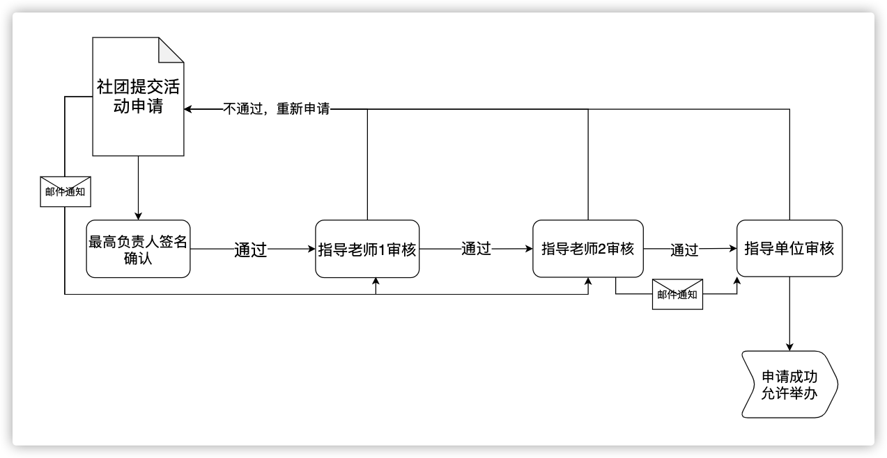

# 活动审批业务

各社团申请活动必须经过社长、所有指导老师、指导单位的审核确认后才能被批准举办，其中涉及活动审批流程、状态判定、邮箱提醒机制等业务逻辑。

活动审核流程如下图：

具体业务流程描述如下：

1. 社团账号管理者在系统提交活动申请表，需要填写必要信息并上传活动策划书，提交成功后等待审核。此时发送邮件通知所有老师进行活动审核。
2. 社团的最高负责人（社长或会长）进行确定，评语与签名，确认无误后进入下一流程。
3. 各指导老师进行对活动进行审核，且必须所有老师审核通过后活动才能进行最后的指导单位审核。若在此阶段有一老师不批准活动，则直接判定为活动通不过审核，同时发送邮件提醒社团活动的审核结果为：不通过。当所有老师都审核通过后发送邮件提醒指导单位进行审核，活动审核流程也进行最后阶段。
4. 指导单位审核通过与否也会发送邮箱通知活动申请社团，若指导单位审核通过则活动完成审核流程，可以合规举办。否则也属于审核不通过，可选择重新提交申请。