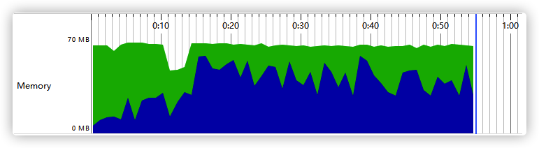

# 批量数据处理

主要的一个业务场景是导入Execel表格里的信息，当信息量很大的话可能就会导致OOM。

本系统采用开源库`EasyExcel`来解决批量数据导入到问题。

EasyExcel是一个基于Java的简单、省内存的读写Excel的开源项目。在尽可能节约内存的情况下支持读写百M的Excel。



引入依赖

``` xml
<!-- easy-excel -->
<dependency>
    <groupId>com.alibaba</groupId>
    <artifactId>easyexcel</artifactId>
    <version>2.1.6</version>
    <exclusions>
</dependency>
```

读取数据

```java
EasyExcel.read(file.getInputStream(), Student.class, new StudentNewEraDataListener(uploadExcelService)).sheet().doRead();
```

需要定义一个DataListener的类对数据进行处理

```java
public class StudentUploadDataListener extends AnalysisEventListener<Student> {

    /**
     * 每隔1000条存储数据库，然后清理list ，方便内存回收
     */
    private static final int BATCH_COUNT = 1000;
    private final List<Student> list = new ArrayList<>();

    private final UploadExcelServiceImpl uploadExcelServiceImpl;

    public StudentUploadDataListener(UploadExcelServiceImpl uploadExcelServiceImpl) {
        this.uploadExcelServiceImpl = uploadExcelServiceImpl;
    }

    /**
     * 这个每一条数据解析都会来调用
     */
    @Override
    public void invoke(Student data, AnalysisContext context) {

        if (data.getMajorDirection() == null){
            data.setMajorDirection("");
        }
        this.list.add(data);
        // 达到BATCH_COUNT了，需要去存储一次数据库，防止数据几万条数据在内存，容易OOM
        if (this.list.size() >= BATCH_COUNT) {
            saveData();
            // 存储完成清理 list
            this.list.clear();
        }
    }

    /**
     * 所有数据解析完成了 都会来调用
     */
    @Override
    public void doAfterAllAnalysed(AnalysisContext context) {
        if(this.list.isEmpty()){
            return;
        }
        // 这里也要保存数据，确保最后遗留的数据也存储到数据库
        saveData();
    }

    /**
     * 存入数据库
     */
    @Transactional
    public void saveData() {
        uploadExcelServiceImpl.saveStudent(this.list);
    }
}
```

从以上示例代码可以看到为了避免一次性处理过多数据导致内存溢出，我们用一个list每次只读1000条数据，存入数据库后进行清理再读，防止OOM。