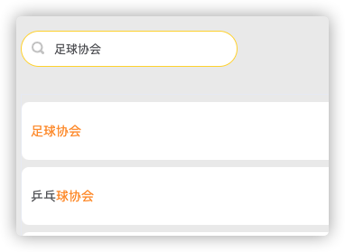

# 搜索增强

为了得到更好的搜索效果，系统采用`ElasticSearch`搜索引擎对搜索效果进行增强。

## 搜索结果排名

ElasticSearch对搜索结果进行打分排名，`“_score”`字段就是打分的结果，从而来找到与关键词匹配度最高的结果以及其它可能相关的结果。
对于中文的搜索结果同时也提供了分词器（ik分词器）来对模糊搜索更好的支持

以下是当对clubName字段搜索关键词"足球协会"时的结果示例：

```json
{
  "took" : 0,
  "timed_out" : false,
  "_shards" : {
    "total" : 1,
    "successful" : 1,
    "skipped" : 0,
    "failed" : 0
  },
  "hits" : {
    "total" : {
      "value" : 42,
      "relation" : "eq"
    },
    "max_score" : 8.457974,
    "hits" : [
      {
        "_index" : "club",
        "_type" : "_doc",
        "_id" : "32",
        "_score" : 8.457974,
        "_source" : {
          "clubID" : 32,
          "clubName" : "足球协会",
          "deprecated" : 0,
          "year" : 2020
        }
      },
      {
        "_index" : "club",
        "_type" : "_doc",
        "_id" : "43",
        "_score" : 3.5766585,
        "_source" : {
          "clubID" : 43,
          "clubName" : "乒乓球协会",
          "deprecated" : 0,
          "year" : 2020
        }
      },
      {
        "_index" : "club",
        "_type" : "_doc",
        "_id" : "47",
        "_score" : 3.3643284,
        "_source" : {
          "clubID" : 47,
          "clubName" : "毽球协会",
          "deprecated" : 0,
          "year" : 2020
        }
      },
      {
        "_index" : "club",
        "_type" : "_doc",
        "_id" : "29",
        "_score" : 3.1757956,
        "_source" : {
          "clubID" : 29,
          "clubName" : "羽毛球协会",
          "deprecated" : 0,
          "year" : 2020
        }
      },
      {
        "_index" : "club",
        "_type" : "_doc",
        "_id" : "31",
        "_score" : 2.4807148,
        "_source" : {
          "clubID" : 31,
          "clubName" : "排球协会",
          "deprecated" : 0,
          "year" : 2020
        }
      }
    ]
  }
}
```


## 搜索高亮

为了让用户直接了当的看到搜索结果中与关键词匹配的部分，参考当今流行的搜索引擎所具备的功能，本系统也用ElasticSearch实现了对搜索结果的高亮。

下面是搜索实现的代码示例：

```java
void testSearch() throws IOException {

    // SearchRequest 搜索请求
    SearchRequest searchRequest = new SearchRequest("test");
    SearchSourceBuilder sourceBuilder = new SearchSourceBuilder();

    TermQueryBuilder termQueryBuilder = QueryBuilders.termQuery("name", "ccq");
    sourceBuilder.query(termQueryBuilder);

    sourceBuilder.timeout(new TimeValue(60, TimeUnit.SECONDS));

    // 高亮
    HighlightBuilder highlightBuilder = new HighlightBuilder();
    // 设置高亮的字段
    highlightBuilder.field("name");
    // 多个匹配字高亮
    highlightBuilder.requireFieldMatch(true);
    // 设置高亮标签
    highlightBuilder.preTags("<span style=\"color:#ffd73b\">");
    highlightBuilder.postTags("</span>");
    sourceBuilder.highlighter(highlightBuilder);

    // 执行搜索
    searchRequest.source(sourceBuilder);
    SearchResponse searchResponse = client.search(searchRequest, RequestOptions.DEFAULT);

    System.out.println(JSON.toJSONString(searchResponse.getHits()));
    for (SearchHit hit : searchResponse.getHits()) {
        // 获取高亮字段
        Map<String, HighlightField> highlightFields = hit.getHighlightFields();
        HighlightField highlightName = highlightFields.get("name");
        // 原来的结果
        Map<String, Object> sourceAsMap = hit.getSourceAsMap();
        // 用高亮替换原来的，这里要判断一个是否为空，因为有可能没有高亮结果
        if (highlightName != null) {
            Text[] fragments = highlightName.fragments();
            sourceAsMap.put("name", fragments[0]);
        }
        System.out.println(sourceAsMap);
    }
}
```

下面是搜索高亮效果示例：


