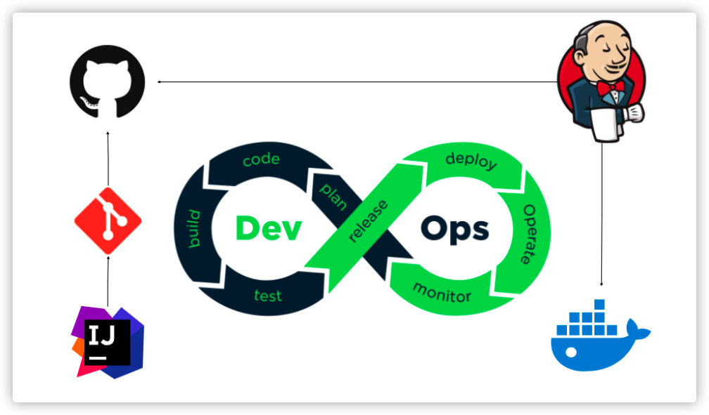
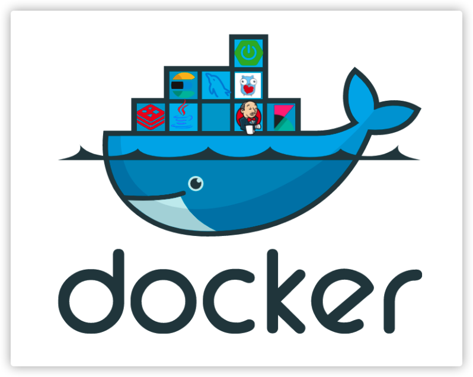

# 自动化运维

为了加快项目部署和版本迭代，传统的打Jar包再上传的方式效率太低，本系统采用CI/CD持续集成持续部署的方式进行自动化运维。

这符合了最近大火的DevOps理念，我们把代码用git做版本管理，github做代码仓库，上传到github后触发webhook，自动化运维工具Jenkins就会自己从github的代码仓库中拉取代码并进行本地的自动编译、打包、构建、运行。整个过程完全自动化，只需在Jenkins中做好相应的配置即可。

同时采用了云原生的容器结束，项目中大部分的中间件或应用都采用docker进行部署。

docker是一种虚拟化技术采用rootfs，每个容器里都是一个独立的文件系统，包含启动一个应用所需的环境依赖，所有容器共用一个宿主机的操作系统内核。容器之间像沙箱一样相互隔离，抽象出镜像后可以别的物理机方便地直接运行，大大提高了可移植性。

