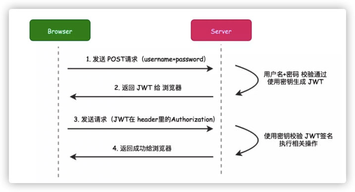

# 鉴权与权限控制

## 鉴权

鉴权常用的是cookie、session、token，本项目采用的是Spring Security + JWT的权限方式，使得客户端与服务端无状态身份识别与权限控制，同时不需要在服务端存储用户的登录态信息也节约了服务器的资源。

#### JWT

携带有用户相关信息的token，一般客户端存放在header中发送到服务端，服务端接收后利用里面的信息进行身份验证和权限控制。



jwt一般包括三个部分

* 头部 (Header)

  用于声明类型和加密的算法

* 载荷 (Payload)

  存放过期时间、签发人、编号等，也可以自定义载体存放系统自己的用户信息

* 签名 (Signature)

  对签名两部分的签名，防止数据篡改，通过密钥进行加密，常用算法是SHA256等。

每次请求接口我们可以用一个filter来判断token是否过期以及用户的权限是否足够去访问资源，最后用载荷中的user_id之类的用户唯一标示就可以唯一识别一个用户。

## 权限控制

系统包括多种不同的角色，比如老师、学生、指导单位等，不同角色对不同内容访问的权限不同，因而系统需要加入权限控制功能。

本系统采用Spring Security进行权限控制，在jwt的载荷中携带自定义字段`role`，存放用户的身份信息。服务端采用RESTful风格的接口，大部分接口已经按权限进了路由划分，同时在web安全配置中进行了权限的配置。

```java
@Override
protected void configure(HttpSecurity httpSecurity) throws Exception {
  httpSecurity
    // CORS
    .cors().and()
    // 设置无状态的连接,即不创建session
    .sessionManagement().sessionCreationPolicy(SessionCreationPolicy.STATELESS).and()
    .authorizeRequests()
    // 配置swagger和druid界面等通用组件等匿名访问
    .antMatchers("/swagger-ui.html").permitAll()
    /*
      业务接口的匿名访问
    */
    .antMatchers("/user/login").permitAll()
    /*
      业务接口的配置权限访问控制
    */
    .antMatchers("/dept/list/**").hasAnyRole("club", "student", "admin")
    /* ..... */
    .anyRequest().authenticated();  
}
```

如果用户的权限不足，则会返回：

```json
 {
  "timestamp": "2021-01-19T03:45:00.182+00:00",
  "status": 403,
  "error": "Forbidden",
  "message": "",
  "path": "/user/only_admin"
}
```

