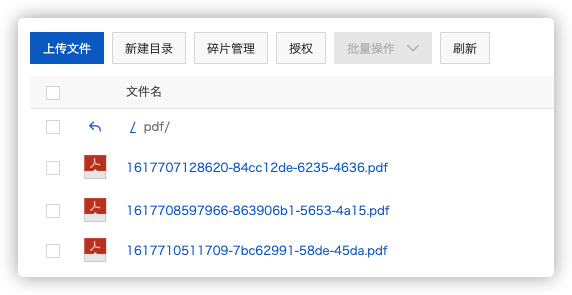

# 静态文件存储

对于经常访问到的图片或其它静态文件且追求速度，可以使用CDN进行加速。

对于大批量的图片或者文件需要存储用OSS比较合适。

在阿里云购买相关服务产品后，获取`accessKeyId`和`accessKeySecret`后就可以在配置文件中添加

```yaml
oss:
  endpoint: 
  url: 
  accessKeyId: 
  accessKeySecret: 
  bucketName:
```

引入必要依赖：

```xml
<!-- OSS -->
<dependency>
  <groupId>com.aliyun.oss</groupId>
  <artifactId>aliyun-sdk-oss</artifactId>
  <version>3.4.2</version>
</dependency>
```

编写工具类：

```java
public static String upload(OSSConfig ossConfig, InputStream inputStream, String originalFilename, String fileDir) {
    // 初始化客户端
    initOSS(ossConfig);
    // 文件URL
    StringBuilder fileUrl = new StringBuilder();

    // 获得文件名后缀,并生成文件名唯一标识
    String suffix = originalFilename.substring(originalFilename.lastIndexOf('.'));
    String fileName = System.currentTimeMillis() + "-" + UUID.randomUUID().toString().substring(0, 18) + suffix;
    if (!fileDir.endsWith("/")) {
      fileDir = fileDir.concat("/");
    }
    fileUrl = fileUrl.append(fileDir + fileName);

    // 上传文件到指定的存储空间，并将其保存为指定的文件名称
    ossClient.putObject(ossConfig.getBucketName(), fileUrl.toString(), inputStream);

    fileUrl = fileUrl.insert(0, ossConfig.getUrl());
    return fileUrl.toString();
}
```

存放至OSS后并把权限设置为公共就可以让用户访问到了，OSS控制台界面如下：



