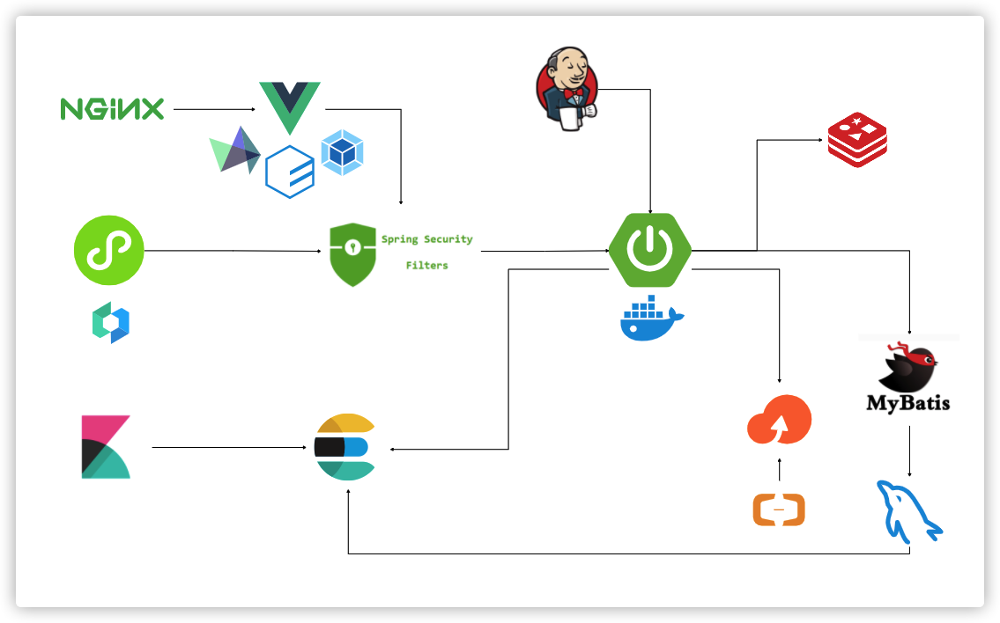

## 所用的各软件及其版本

> 前端

| 软件或技术 | 版本号 |
| ---------- | ------ |
| Vue        | 2.x    |
| Element    |        |
|            |        |

> 后端

| 软件或技术      | 版本号            |
| --------------- | ----------------- |
| Java            | OpenJDK 1.8.0_275 |
| SpringBoot      | 2.4.1             |
| MySQL           | 5.7               |
| Redis           | 6.0.9             |
| Spring Security | 5.4.2             |
| MyBatis         | 2.1.1             |
| ElasticSearch   | 7.9.3             |
| Kibana          | 7.9.3             |
| Druid           | 1.1.20            |
| slf4j-log4j12   | 1.8.0-alpha2      |
| Hutool          | 5.5.7             |
| validation      | 2.4.1             |
| easyexcel       | 2.1.6             |
| fastjson        | 1.2.73            |
| aliyun-sdk-oss  | 3.4.2             |
| junit           | 4.12              |
| jasypt          | 3.0.3             |
| swagger         | 2.9.2             |
| knife4j         | 2.0.8             |
| lombok          | 1.16.18           |

> 运维端

| 软件或技术 | 版本号  |
| ---------- | ------- |
| Docker     | 20.10.2 |
| Jenkins    | 2.287   |
| nginx      | 1.16.1  |

## 整体架构图

项目架构采用前后端分离的架构，分别部署了小程序端和web端，后台统一暴露接口，采用Spring Security进行鉴权，Spring Boot构建应用，持久层关系型数据库是MySQL，缓存用NoSQL的Redis，为了实现更好的搜索业务，我们还采用了Elasticsearch，同时Kibana做监控，应用基本都部署在Docker容器中，贴近云原生的理念。

